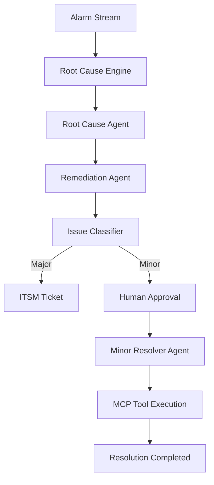

# Telecom NOC Agentic Copilot

This workspace contains a production-style prototype for an AMD Developer Cloud telecom NOC copilot built with Python, Jupyter, ROCm-ready orchestration, LangGraph, ChromaDB, FastAPI, and Streamlit.

## Project structure

```text
app/
  __init__.py
  agents.py
  data_generation.py
  engine.py
  mcp_server.py
  run_demo.py
  streamlit_app.py
requirements.txt
README.md
```

## Architecture overview



## Run locally

1. Create and activate a virtual environment.
2. Install dependencies: `pip install -r requirements.txt` and `pip install "streamlit[pdf]"`
3. Generate assets: `python -m app.run_demo`
4. Launch the MCP server: `python -m app.mcp_server`
5. Launch the UI: `streamlit run app/streamlit_app.py`

## AMD ROCm and vLLM guidance

```bash
VLLM_USE_TRITON_FLASH_ATTN=0
vllm serve Qwen/Qwen3-30B-A3B \
  --served-model-name TelecomCopilot \
  --api-key abc-123 \
  --port 8000 \
  --enable-auto-tool-choice \
  --tool-call-parser hermes \
  --trust-remote-code
```

### GPU optimization recommendations
- Prefer MI300X or MI250-class GPUs for larger inference loads.
- Use tensor parallelism for multi-GPU systems.
- Keep KV cache sizes moderate for long context windows.

### Memory optimization recommendations
- Use quantized models such as AWQ or GPTQ for large MoE models.
- Keep the prompt context compact for the RAG component.
- Cache the ChromaDB index locally to reduce startup cost.

### Quantized model recommendations
- Qwen/Qwen3-8B or Qwen/Qwen3-14B for lower-memory local inference.
- Use 4-bit quantized variants when running on 24 GB VRAM GPUs.
